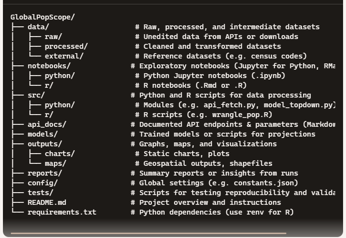

# GlobalPopScope

Population analytics using Python & R to understand global demographic trends and support future well-being.

## Structure
See subfolders for raw data, processed outputs, models, and more.

🌍 GlobalPopScope
GlobalPopScope is a data-driven exploration into the evolving dynamics of the world’s population. It leverages Python, R, and high-resolution datasets to model demographic trends, forecast future challenges, and inform strategies for equitable human well-being.

🧭 Project Vision
To create a scalable and modular research framework that:

🌐 Maps and monitors global demographic changes across space and time

🔍 Analyzes patterns and disparities across socioeconomic and geographic dimensions

🛠️ Builds tools that help policy-makers, researchers, and humanitarians make better decisions

📡 Predicts future needs — from climate resilience to resource planning — powered by real population data

🧰 Tools and Technologies
This project combines the best of both worlds:

Python — for API access, data engineering, and machine learning

R — for statistical modeling and visualization

UN Population APIs — pulling projections from 1950 to 2100

WorldPop & Subnational Census Datasets — for granular, geospatial insights

VS Code + GitHub — tracking progress and enabling collaboration

🗂️ Folder Structure Overview
Directory	Purpose
data/	Raw, processed, and reference datasets
notebooks/	Python and R notebooks for exploration
src/	Scripts for data fetching, cleaning, modeling
api_docs/	Endpoint guides and query examples
models/	Predictive and top-down population models
outputs/	Maps, charts, and visualizations
reports/	Summaries and insights from analysis
config/	Settings and constants
tests/	Validation and reproducibility scripts
🚀 Goals & Milestones
✅ Phase 1 — Setup & Data Integration 🔄 Phase 2 — API automation & top-down modeling 📊 Phase 3 — Visual analytics & dashboards 🌱 Phase 4 — Open-source data products for global use

🙌 Contributions Welcome
Whether you’re a data scientist, GIS analyst, or population geek — your insights can shape this project. Feel free to fork, star, or raise issues to collaborate.

Let me know if you want to add badges (e.g. Python version, license, contributors), set up documentation scaffolding, or generate a visual banner. We can polish this README until it sparkles ✨